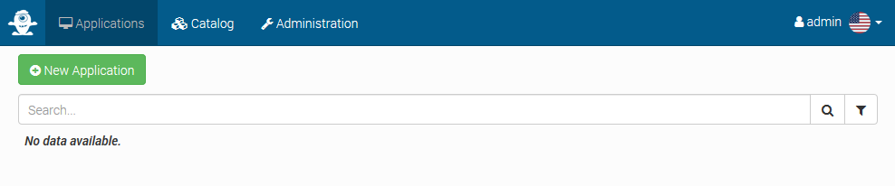
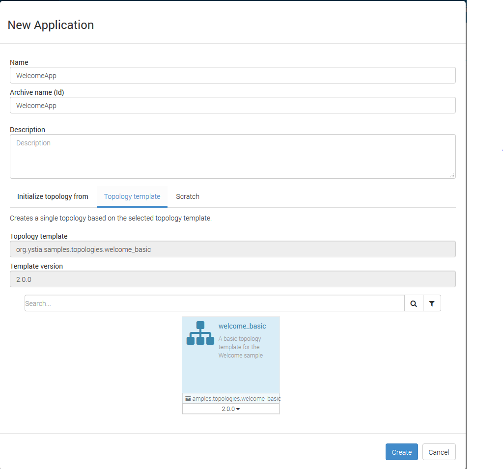
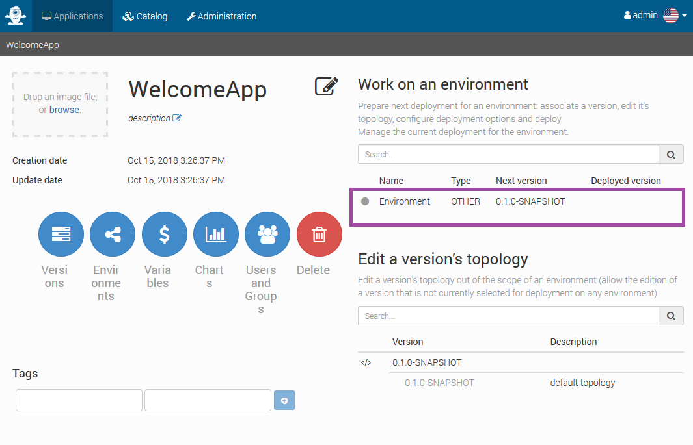
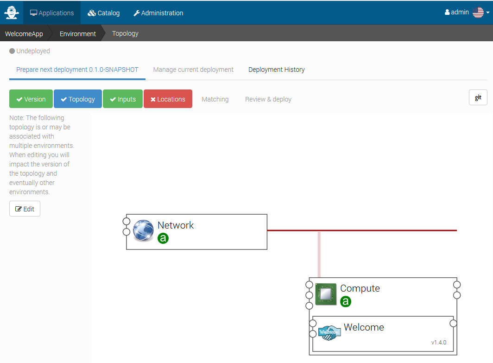
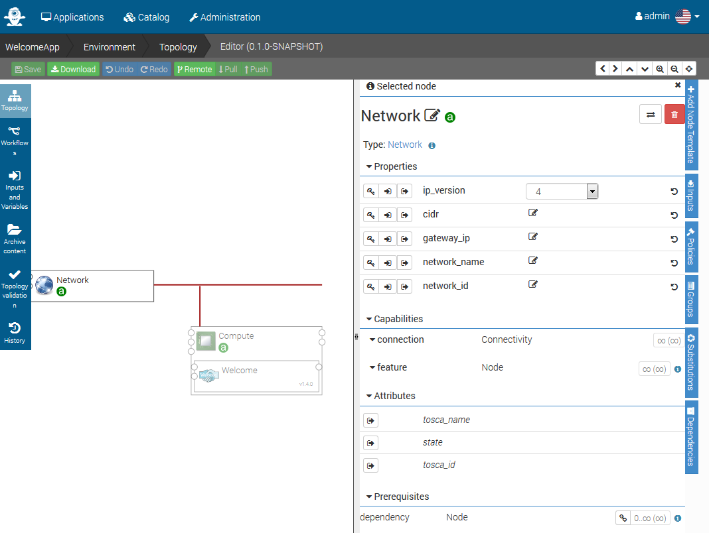
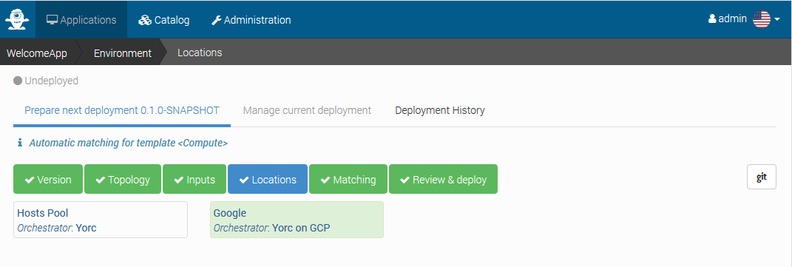
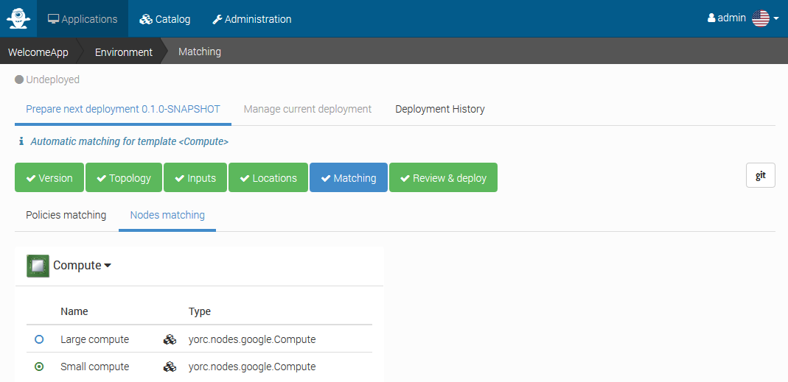
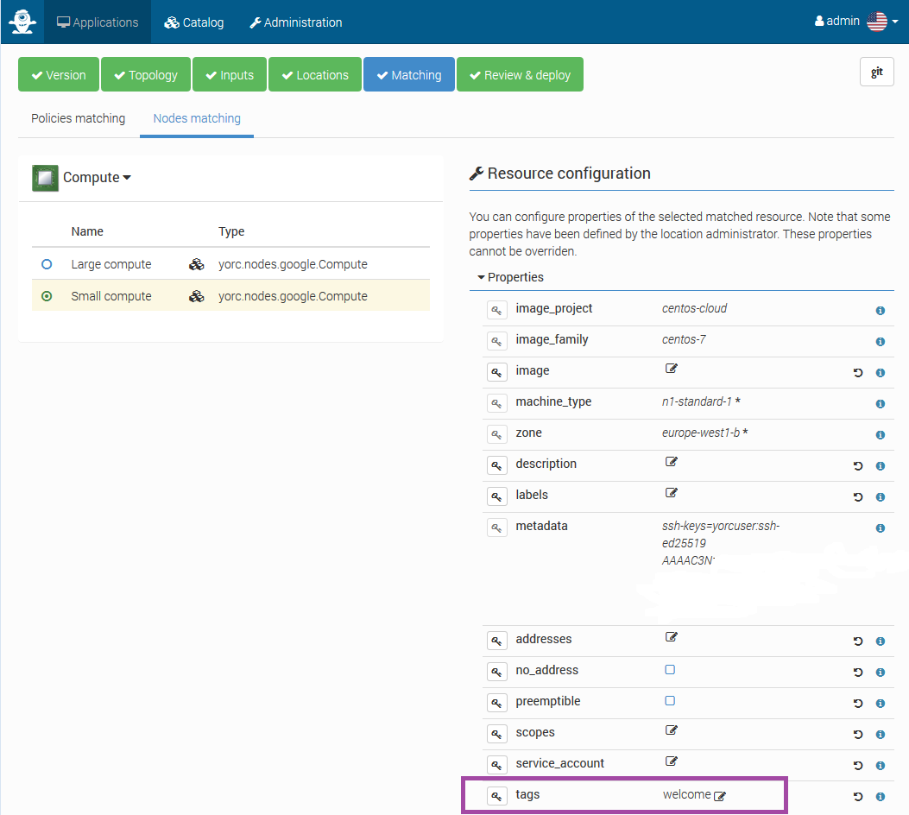
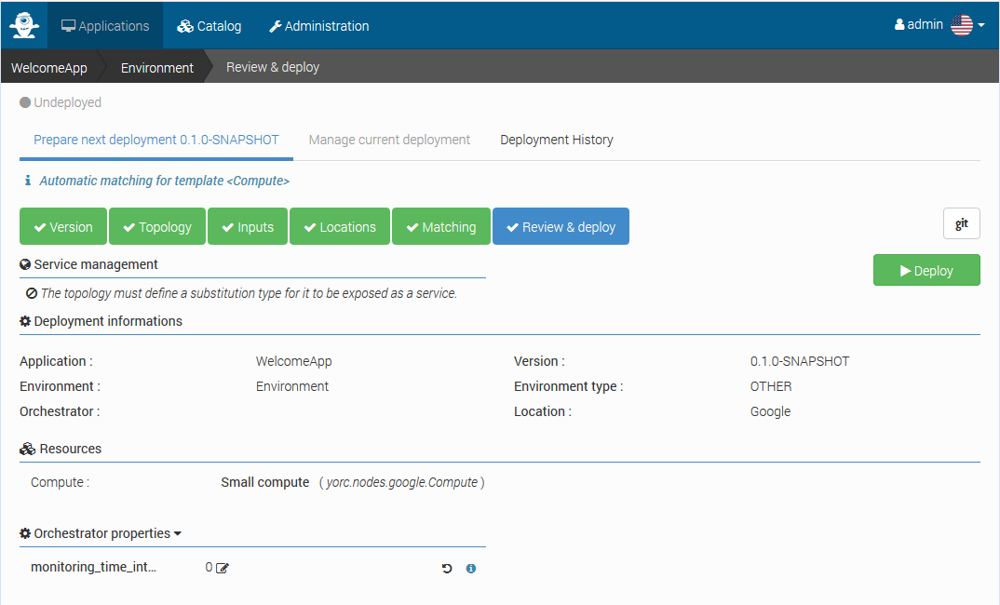
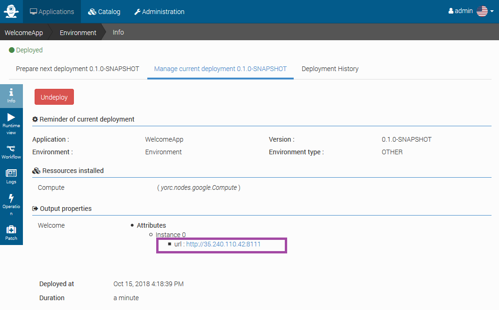

# Create and deploy an application

From Alien4Cloud menu `Applications`, click on `New Application` :



Provide an application name, `WelcomeApp` for example, and select the option
to initialize the application from a `Topology template` and select the template
`welcome_basic` as here :



Click on `Create`, the application is created :



Click on the `Environment` line framed in purple above, the application deployment
wizard starts. Click on `Topology` to see the application template :



Here the compute node is associated to a network, so that during the application
deployment, an IP address will be generated on-demand for the Compute Node on this
network.

You see a green `a` on these components `Network` and `Compute` as these are abstract
nodes with no implementation, that will be replaced by concrete implementations
of on-demand resources once you will have selected the location where to deploy
the application.

But here we defined a Hosts Pool location and a Google Cloud location, which in
Yorc 3.1.1 just support Compute Nodes on-demand resources, not IP addresses or
networks. So we will remove this Network component by clicking on `Edit`,
selecting the Network Component and clicking on the trash can icon on the upper
right hand side :



Once done, click on `Save`, then click on `Topology` to go on in the deployment wizard,
to next step `Locations`, and select the `Google` location:



Click on `Matching`, then `Nodes matching` and check that the abstract Compute Node
that was defined in our topology, was matched against a `Small compute` on-demand
resource of type `yorc.nodes.google.Compute` :



If we had specified in the abstract Compute Node in the topology that 2 CPUs are
requested, then it is the `Large compute` on-demand resource that would have been
selected.

You can also from this screen select `Small compute` and update this on-demand
resource properties.

We will do it here to add a value to the property `tag`, setting a tag `welcome`:



This tag will be needed as we will deploy our Web Server application on a Google Compute instance,
using port 8111. By default this port is not open to the external world.
And it is possible to create a firewall rule in Google Cloud to specify instances
with a given tag expose a given port.

For example this Google Cloud CLI rule expose ports 8111 on all Compute instances
having the tag welcome :

```bash
gcloud compute firewall-rules create welcome-demo \
         --allow tcp:8111 \
         --target-tags welcome
```

Now that you have added this tag to the Compute instance to create on demand,
click on `Review and deploy`, you are ready to deploy the application on Google Cloud:



Click on `Deploy` to deploy the application.

Once deployed, click on `info` on the left hand side, and you should see details
on the deployed application, like the URL on which you can click to check the
deployed Web Server is up and running showing a Welcome message.



Next step is about [troubleshooting an application deployment failure](../troubleshooting/troubleshoot-deployment.md)
