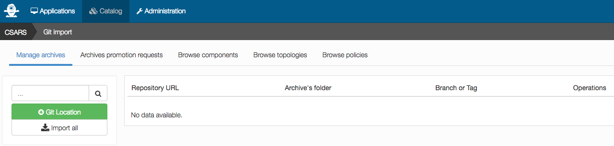
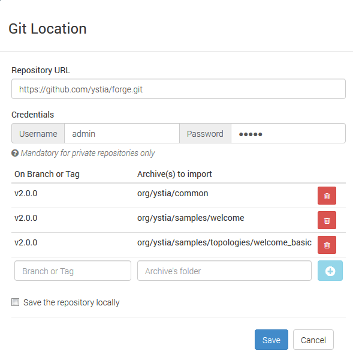

# Upload Components/Application templates from Ystia Forge

The Ystia Forge at https://github.com/ystia/forge provides components and application 
templates that can be uploaded in Alien4Cloud, to be deployed by Yorc.

For example, it provides :
  * [Cloudera](https://github.com/ystia/forge/tree/v2.1.0/org/ystia/cloudera),
  * [Log analysis applications based on Elatic Search](https://github.com/ystia/forge/tree/v2.1.0/org/ystia#topologies-for-log-analysis-based-on-elastic-stack)
  * [Kafka](https://github.com/ystia/forge/tree/v2.1.0/org/ystia/kafka)
  * [Kubernetes](https://github.com/ystia/forge/tree/v2.1.0/org/ystia/kubernetes)
     allowing you to create a Kubernetes cluster in your datacenter.
  * etc...

See the list of available components and application templates at https://github.com/ystia/forge/tree/v2.1.0/org/ystia.

Here, we will upload a sample application template, [Welcome](https://github.com/ystia/forge/tree/v2.1.0/org/ystia/samples/topologies/welcome_basic),
deploying an HTTP server.

To upload this application template in Alien4Cloud, you could generate zip archives
and upload these archives in Alien4Cloud.

Or you can directly upload a git repository from Alien4Cloud. This is what is done below.

From Alien4Cloud UI, select menus `Catalog` > `Manage Archives` > `Git Import`.
This page appears :

Click on `Git location`, a popup appears where you need to provide the following
inputs to import the Welcome sample application template at as well as its dependencies,
common components and the Welcome component referenced in the application template:
  * https://github.com/ystia/forge/tree/v2.1.0/org/ystia/common
  * https://github.com/ystia/forge/tree/v2.1.0/org/ystia/samples/welcome
  * https://github.com/ystia/forge/tree/v2.1.0/org/ystia/samples/topologies/welcome_basic

You need to provide the repository URL: https://github.com/ystia/forge.git.
And for each directory you want to deploy, you need to specify :
  * the `Branch or Tag`: here you need to specify tag `v2.1.0` as this is the version
  of the Forge compatible with Yorc 3.1.1
  * the path to the directory to import.
Then click on `+` to add this tag/directory to the list of directories to import.

It gives finally :

Click on `Save`. Then from this page, click on the operation  `Import` to import
components and the application template:

Once done, you get this page providing the import result:

You can click select in the menu `Browse components` or `Browse topologies` to see
the components/application templates imported in the Alien4Cloud catalog:

Now that the Welcome application template is uploaded, the next step is to
[create and deploy an application](create_deploy.md) from this template.

