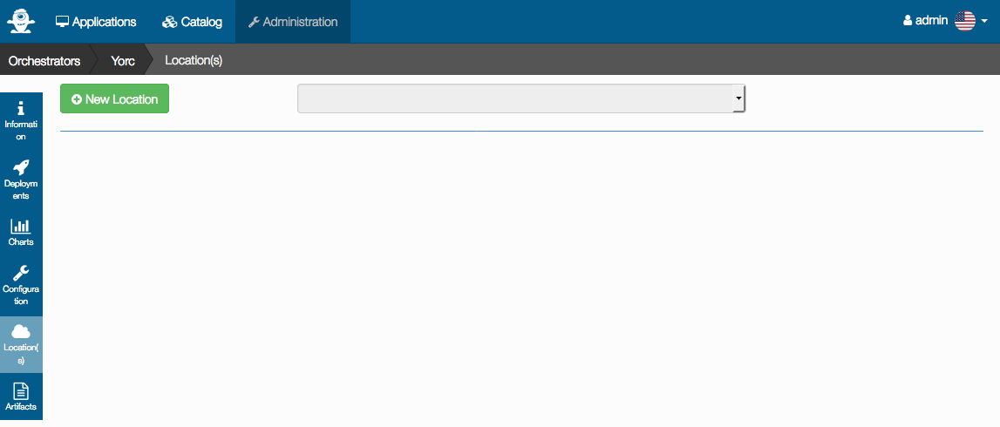
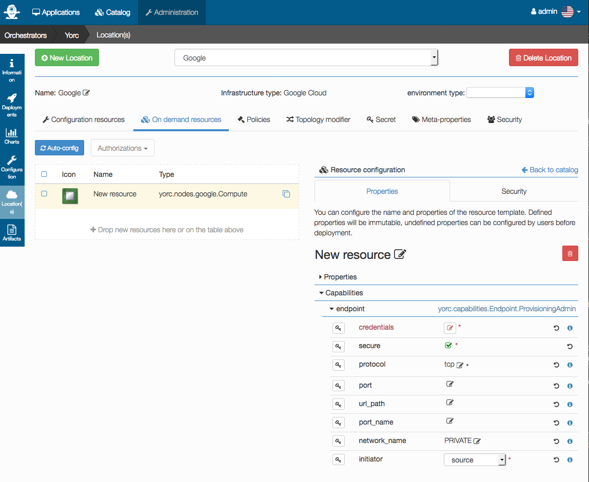
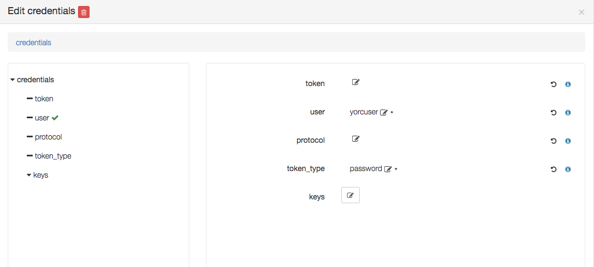
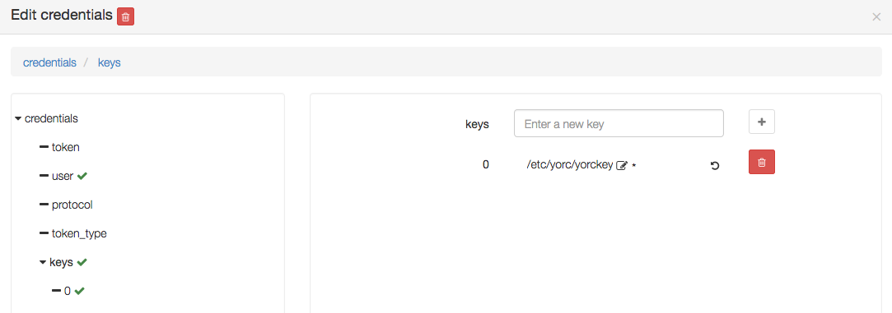
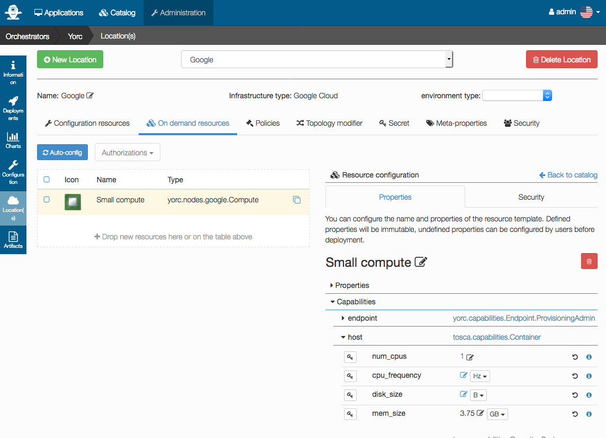
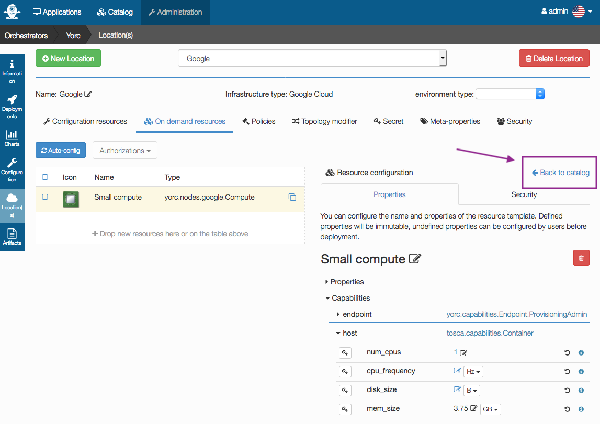
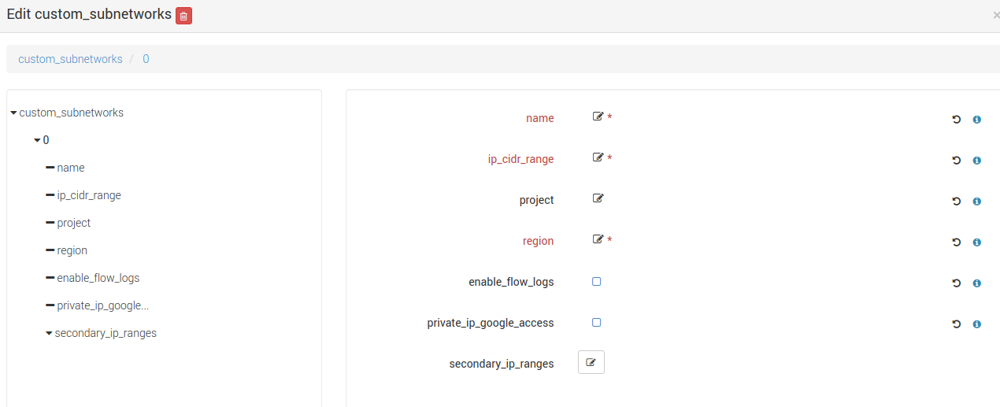

From Alien4Cloud UI, select menus `Administration` > `Orchestrators`, then select
the orchestrator `Yorc`.
A page appears where you can select `Location(s)` on the left hand side :



Click on `New Location`. Enter a name: `Google`. Select the Infrastructure type 
`Google Cloud`:


Click on `Create`. A page appears allowing to configure this location, select the
menu `On demand resources` like below :


In this release, we support the following on-demand resources on Google :
  * Compute Instances (Virtual Machines).
  * Addresses.
  * Persistent Disks.
  * Private Networks.
  * Sub-networks.

### Add a Google Compute instance on-demand resource

To add an on-demand Compute Node, drag the `yorc.nodes.google.Compute` component
on the right hand side cell,
and drop this component to the left hand side cell, to get this :


In this page, you will specify which type of Compute Instance will be created, 
to define which Operating System will be installed, how many CPUs, how much memory 
must be allocated,etc...
Credentials will have also to be defined, so that Yorc can ssh on the created 
on-demand compute instance.

You could generate ssh private/public keys on Yorc host running this command 
(to keep the configuration simple, we don't specify any passphrase here):
```bash
$ ssh-keygen -t ed25519 -f /etc/yorc/yorckey
```
This will generate a private key file `/etc/yorc/yorckey`and a public key file `/etc/yorc/yorckey.pub`.
The algorithm 

Ensure these files are owned by the user use to run the yorc server.
Make sure as well that these files are read-only for this user, and have no other
permissions set, for example run :
```bash
$ chmod 400 /etc/yorc/yorckey*
```

Now that you have ssh keys generated, go back to AlienCloud UI to provide input 
values for our new Compute Resource :


Here we will specify to create a `centos-7` compute instance of type `n1-standard-1`,
which from [Google Cloud documentation](https://cloud.google.com/compute/docs/machine-types) 
is a machine of 1vCPU and 3.75 GB, by setting these properties:
  * `image_project`: centos-cloud
  * `image_family`: centos-7
  * `machine_type`: n1-standard-1
  * `zone`: europe-west1-b

The `metadata` property allows to define a user and its public key content that will 
be configured on the newly created instance.
The expected format for this is :
```
ssh-keys=<user to create>:<content of the public key>
```
So we will specify to create a user called `yorcuser` on the instance to
create, and we will provide the content of file `/etc/yorc/yorckey.pub` created
above.

Below in the page, you need also to configure credentials. This is a mandatory input
appearing in red when not yet provided :



Edit `credentials` to define the user :



Edit `keys` to add a key `0` with a value being the path to a private key:



You can also here define hardware or OS settings like the number of CPUs or memory size,
so that when resources allocations requirements are specified in a an application
template to deploy, an on-demand resource matching this criteria will be selected :


Let's define the number of CPUs and memory corresponding to Google Machine machine
 type `n1-standard`, and rename our on-demand resource `New Resource` as `Small compute`:



And let's define another on-demand resource to be able to create a compute instance
with more resources when needed.
For this, select `Back to Catalog ` :



And drag and drop again the `yorc.nodes.google.Compute` component from right hand
side cell to left hand side cell,
then assign properties specifying this time a `machine_type` proerty value `n1-standard-4` 
(4 vCPUs and 15 GB) that will be called `Large compute`:


Compute instance On-demand resource is now configured on this location.

### Add a Google Static IP Address on-demand resource

To add an on-demand Static IP address, drag the `yorc.nodes.google.PublicNetwork` component
on the right hand side cell,
and drop this component to the left hand side cell, to get this :


This node type inherits from `tosca.nodes.Network` and allows to substitute generic Network type. At post-matching step, this node will be replaced by `yorc.nodes.google.Address`. You can directly use this node type if you need to define specific Google Address properties.

If you want to use any existing Google Static IP Addresses, you need to set the `addresses` parameter. It accepts a comma-separated list of addresses IPs.

For details on other optional Address properties, see [Address Creation](https://cloud.google.com/sdk/gcloud/reference/compute/addresses/create).


### Add a Google Persistent Disk on-demand resource

To add an on-demand Persistent Disk Node, drag the `yorc.nodes.google.PersistentDisk` component
on the right hand side cell,
and drop this component to the left hand side cell, to get this :


Set the mandatory parameter `zone` to define the zone on which the disk resides.
In any case the disk must be on the same zone as the associated Compute instances.
See [list of available regions and zones](https://cloud.google.com/compute/docs/regions-zones/).

Set the mandatory parameter `size` to define the required size for persistent disks.

If you want the disk to be deleted when the application referencing this disk is undeployed,
check the parameter `deletable`. By default, the disk is not deleted.

If you want to refer to an existing disk, set the mandatory parameter `volume_id` with its Google Reference Name. This parameter allows comma-separated values of disk names.

If you want to attach the disk to a compute with a `READ_ONLY` mode, you need to set this property to the `yorc.relationships.google.AttachesTo` relationship between the disk and the compute.

For details on other optional PersistentDisk properties, see [Persistent Disk Creation](https://cloud.google.com/sdk/gcloud/reference/compute/disks/create).

### Add a Google Private Network on-demand resource

To add an on-demand Private Network Node, drag the `yorc.nodes.google.PrivateNetwork` component
on the right hand side cell,
and drop this component to the left hand side cell, to get this :


If you want to use an existing network, set the parameter `network_name`. Otherwise, let it blank.

You can create custom or default subnet for new or existing network too as long as there is no CIDR range overlaps.

For private network creation, You can specify subnets in three different ways:
  * by checking the checkbox `auto_create_subnetworks` : Google will create a subnet for each region automatically with predefined IP ranges.
  * by setting `cidr` and `cidr_region` : a default subnet will be created with the specified IP CIDR range in the Google specified region.
  * by adding custom subnets : you can add several subnets with more accurate properties as described below.

  You can as well use the auto-create mode and adding default and/or custom subnets as long as there is no CIDR range overlaps.

  Click on the ``custom_subnetworks`` edit icon to create several custom subnets:

  

  Set the mandatory parameters `name``, ``ip_cidr_range` and `region` respectively to define the name of your custom subnet, its IP CIDR range and the Google region it owns. Note that subnet names must be unique in the Google project they owns.

You can configure secondary IP ranges for VM instances contained in this sub-network with `secondary_ip_ranges` list.

You can enable flow logging for this subnetwork by checking the checkbox `enable_flow_logs`.

You can allow the VMs in this subnet to access Google services without assigned external IP addresses by checking the checkbox `private_ip_google_access`.

For details on other optional Private Network properties, see [VPC Creation](https://cloud.google.com/sdk/gcloud/reference/compute/networks/create).

Here are some answers to frequently asked questions...

- `How-to connect a VM to a private subnet after creating the relationship between the VM and a PrivateNetwork ?`

  * Explicitly by setting the subnet property of the Google network relationship ``yorc.relationships.google.Network`` with the required subnet name.
  * Implicitly with the default subnet if exists and in the same region than the VM or otherwise with the first matching subnet in the same region than the VM.

- `Are any firewall rules created for my private network ?`

  Yes, the following default firewall rules are automatically created for each subnet:

  * Ingress rules from any incoming source for ICMP protocol and RDP and SSH ports (TCP 3389 and TCP 22)
  * Ingress rules from any incoming subnet source for ICMP, TCP and UDP protocol on all port ranges (0-65535).  