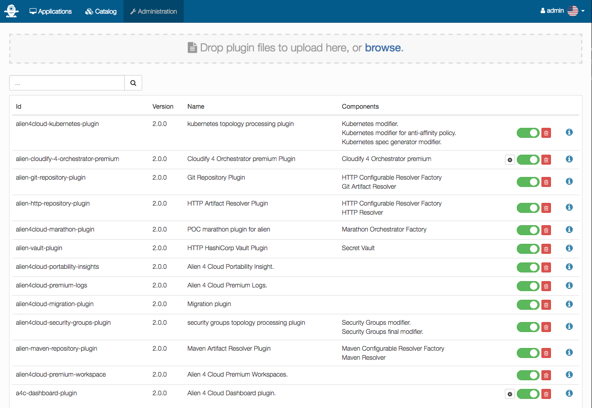
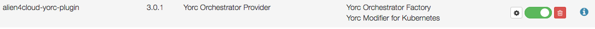
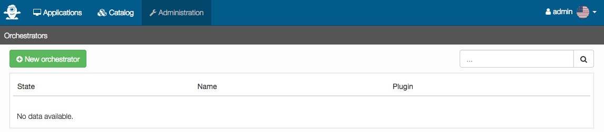
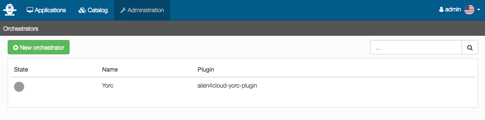
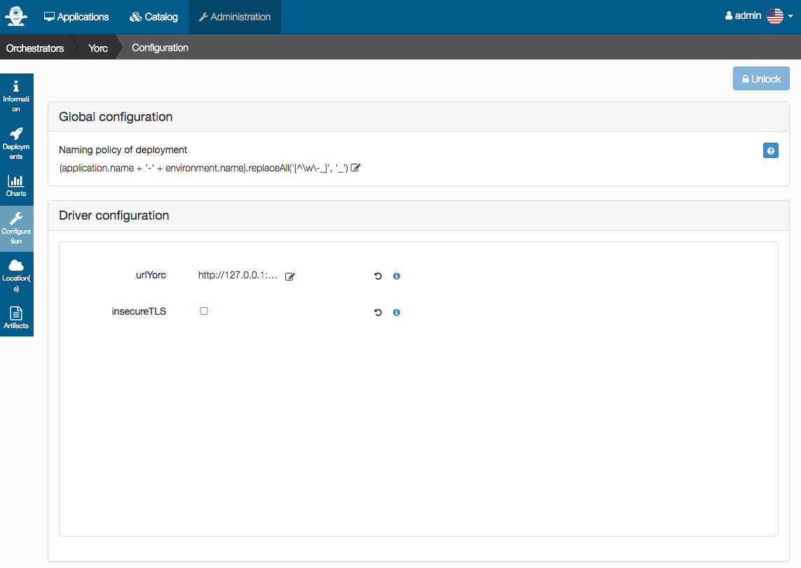
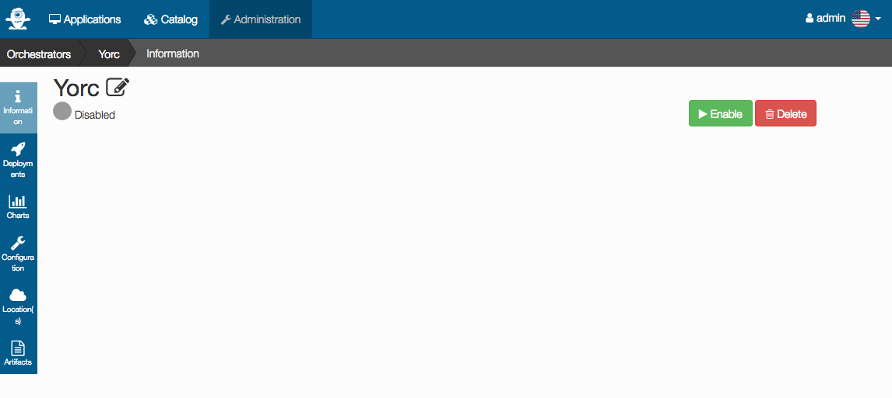
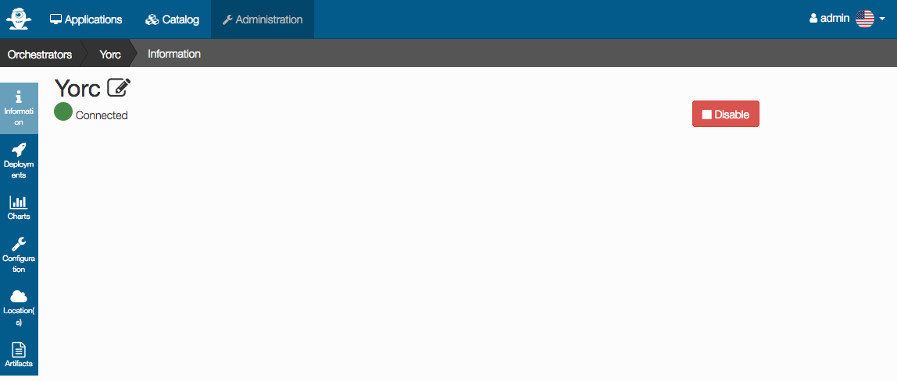

# Configure Alien4Cloud to use Yorc

To configure Alien4Cloud to use Yorc, you need to:
  * upload the Yorc Alien4Cloud plugin in Alien4Cloud,
  * create, configure, enable the orchestrator in Alien4Cloud.

First dowload the Yorc Alien4Cloud plugin 3.0.1 from its github repository at https://github.com/ystia/yorc-a4c-plugin/releases/download/v3.0.1/alien4cloud-yorc-plugin-3.0.1.zip

Then upload it from Alien4Cloud UI, from menus `Administration` > `Plugins` :

Once donce you can see at the end of this page a new plugin :

To create a new orchestraator, select now menus `Administration` > `Orchestrators` to get this page :

Click on `New Orchestrator`, enter `Yorc` as the orchestrator name, and select the Yorc plugin like below :

Click on `Create`, a new Orchestrator is created :

Select this orchestrator, a page appears showing the Orchestrator is in state `Disabled` for now.
Select menu `Configuration` on the left hand side, a page appears where you can 
provide the URL to connect to your Yorc Server :

In the field `urlYorc`, enter a URL like `http://<your host IP address>:8800`.
Once done, select the menu `Information` on the left hand side to get this page :

Click on `Enable`. Alien4Cloud will attempt to connect to Yorc and if everything
goes well, the Orchestrator should then appear as `Connected` :

Alien4Cloud is now configured to use your Yorc Server.

The next step is to [configure deployment locations](configure_a4c_yorc_locations.md):
Google Cloud, OpenStack, AWS, Slurm, Hosts Pools.

