# Configure locations

To be able to deploy applications from Alien4Cloud, you will need to configure locations,
infrastructures where Yorc will allocate resources and deploy the Applications.

Yorc supports the following locations :
  * Google Compute Engine,
  * AWS EC2,
  * OpenStack
  * Kubernetes
  * Slurm,
  * Hosts Pool, pool of any kind of host to which you can connect through ssh

The following sections will describe in details how to configure a Google Compute
Engine location from Alien4Cloud UI, and a Hosts Pool.
For the other locations, see Yorc Alien4Cloud plugin documentation section [Configure a Yorc Orchestrator and a Location](https://yorc-a4c-plugin.readthedocs.io/en/v3.0.2/location.html).

## Configuring a Google Compute Engine location

From Alien4Cloud UI, select menus `Administration` > `Orchestrators`, then select
the orchestrator `Yorc`.
A page appears where you can select `Location(s)` on the left hand side :

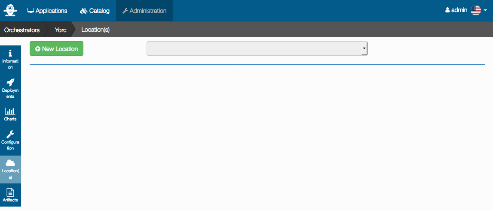

Click on `New Location`. Enter a name: `Google`. Select the Infrastructure type 
`Google Cloud`:

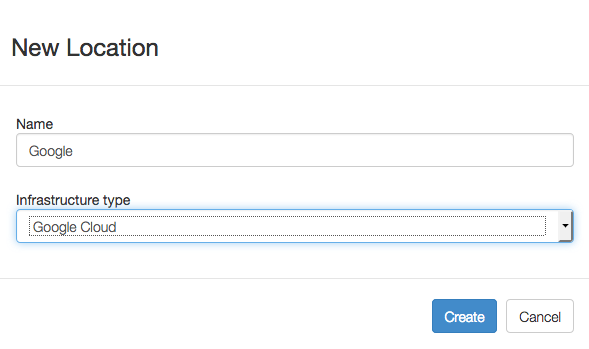

Click on `Create`. A page appears allowing to configure this location, select the
menu `On demand resources` like below :

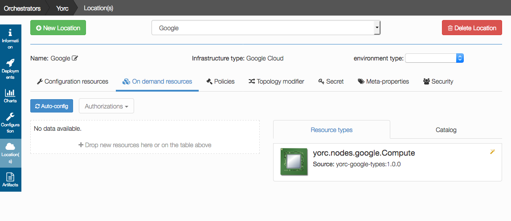

In this release, there is only one type of on-demand resources on Google Cloud:
Compute Instances (Virtual Machines).
Next release will add block storage, IP addresses, networks and others.

To add an on-demand Compute Node, drag the `yorc.nodes.google.Compute` component
on the right hand side cell,
and drop this component to the left hand side cell, to get this :

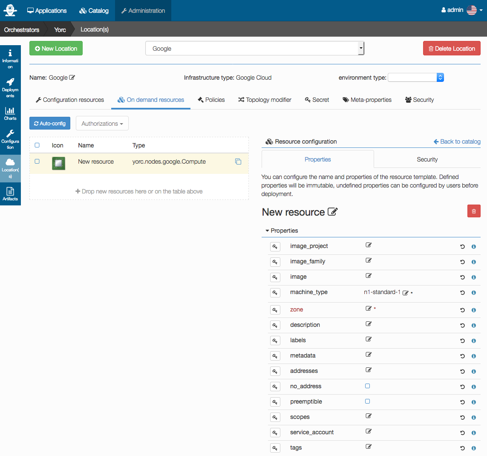

In this page, you will specify which type of Compute Instance will be created, 
to define which Operating System will be installed, how many CPUs, how much memory 
must be allocated,etc...
Credentials will have also to be defined, so that Yorc can ssh on the created 
on-demand compute instance.

You could generate ssh private/public keys on Yorc host running this command 
(to keep the configuration simple, we don't specify any passphrase here):
```bash
$ ssh-keygen -t ed25519 -f /etc/yorc/yorckey
```
This will generate a private key file `/etc/yorc/yorckey`and a public key file `/etc/yorc/yorckey.pub`.
The algorithm 

Ensure these files are owned by the user use to run the yorc server.
Make sure as well that these files are read-only for this user, and have no other
permissions set, for example run :
```bash
$ chmod 400 /etc/yorc/yorckey*
```

Now that you have ssh keys generated, go back to AlienCloud UI to provide input 
values for our new Compute Resource :


Here we will specify to create a `centos-7` compute instance of type `n1-standard-1`,
which from [Google Cloud documentation](https://cloud.google.com/compute/docs/machine-types) 
is a machine of 1vCPU and 3.75 GB, by setting these properties:
  * `image_project`: centos-cloud
  * `image_family`: centos-7
  * `machine_type`: n1-standard-1
  * `zone`: europe-west1-b

The `metadata` property allows to define a user and its public key content that will 
be configured on the newly created instance.
The expected format for this is :
```
ssh-keys=<user to create>:<content of the public key>
```
So we will specify to create a user called `yorcuser` on the instance to
create, and we will provide the content of file `/etc/yorc/yorckey.pub` created
above.

Below in the page, you need also to configure credentials. This is a mandatory input
appearing in red when not yet provided :

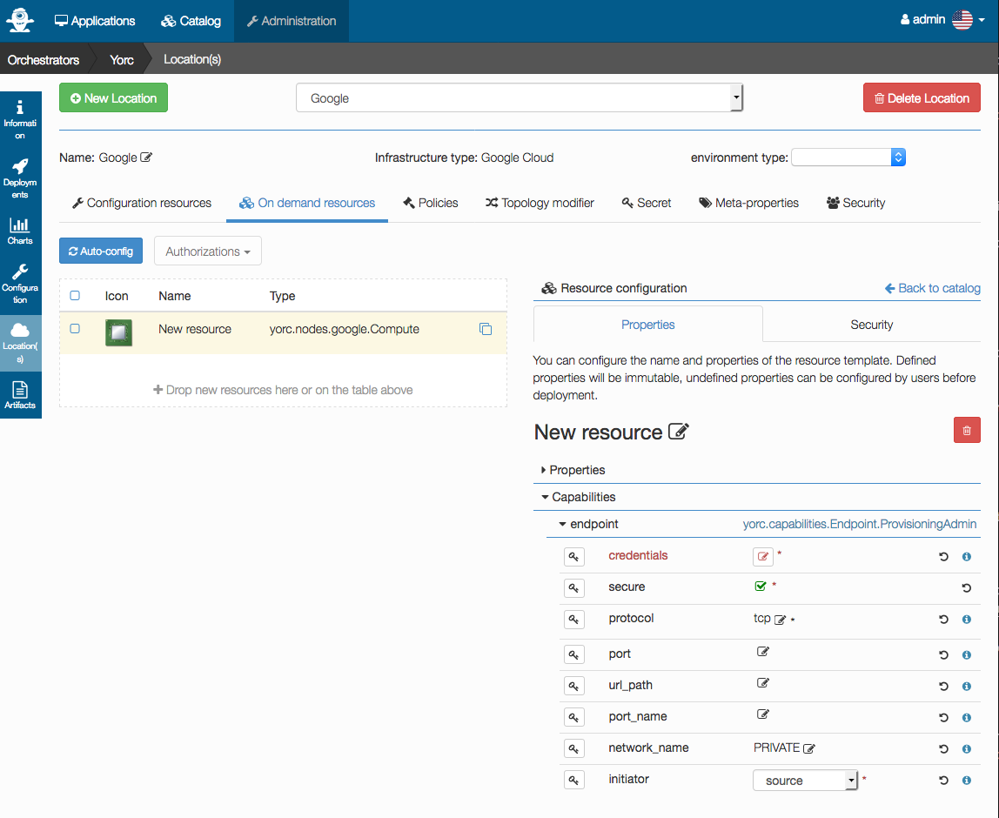

Edit `credentials` to define the user :

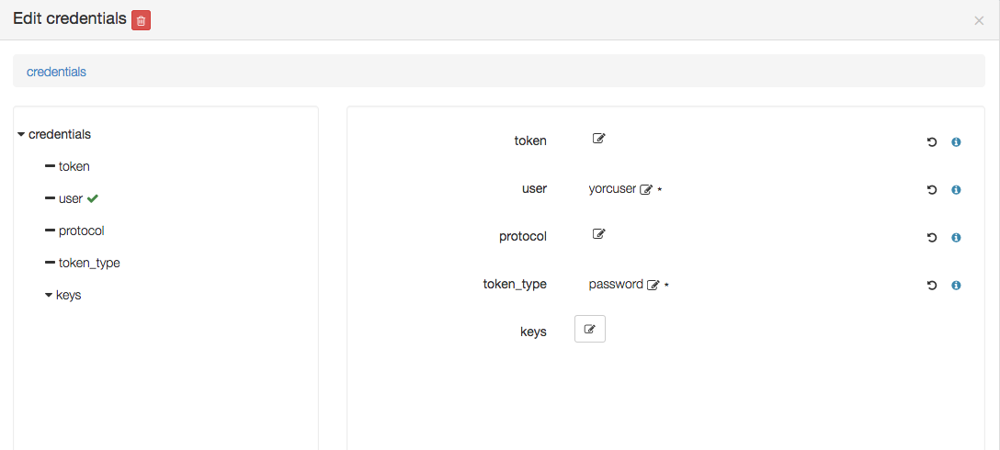

Edit `keys` to add a key `0` with a value being the path to a private key:

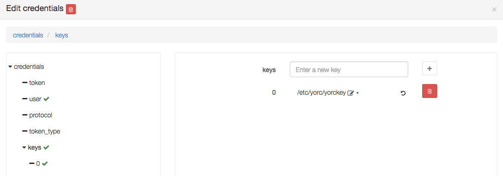

You can also here define hardware or OS settings like the number of CPUs or memory size,
so that when resources allocations requirements are specified in a an application
template to deploy, an on-demand resource matching this criteria will be selected :

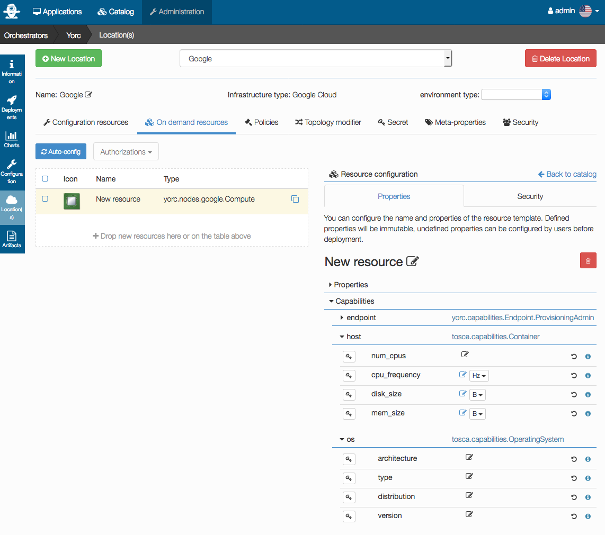

Let's define the number of CPUs and memory corresponding to Google Machine machine
 type `n1-standard`, and rename our on-demand resource `New Resource` as `Small compute`:

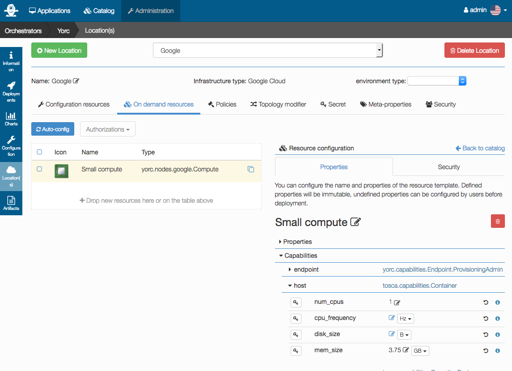

And let's define another on-demand resource to be able to create a compute instance
with more resources when needed.
For this, select `Back to Catalog ` :

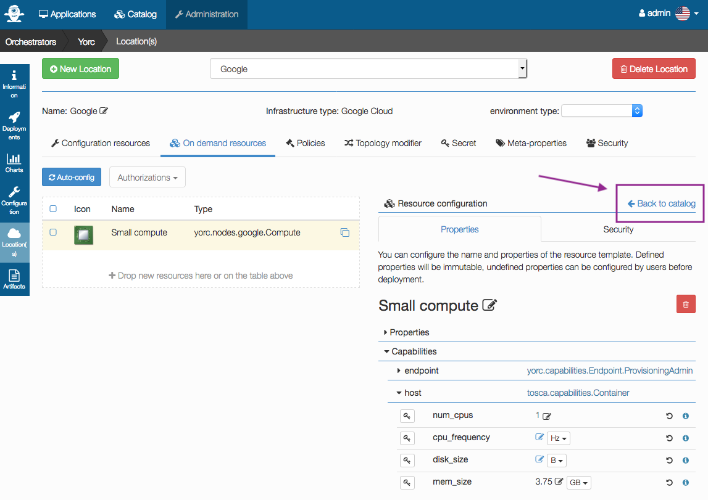

And drag and drop again the `yorc.nodes.google.Compute` component from right hand
side cell to left hand side cell,
then assign properties specifying this time a `machine_type` proerty value `n1-standard-4` 
(4 vCPUs and 15 GB) that will be called `Large compute`:

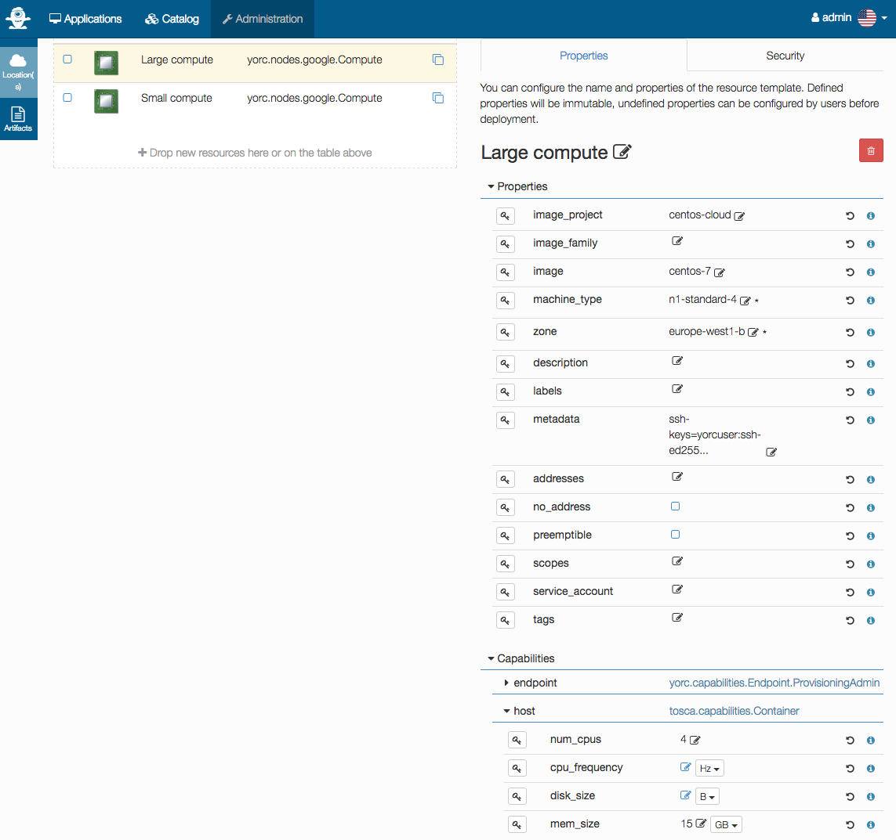

On-demand resources are now configured on this location.

## Configuring a Hosts Pool location

From Alien4Cloud UI, select menus `Administration` > `Orchestrators`, then select
the orchestrator `Yorc`.
A page appears where you can select `Location(s)` on the left hand side :


Click on `New Location`. Enter a name: `Hosts Pool`. Select the Infrastructure type 
`HostsPool`:

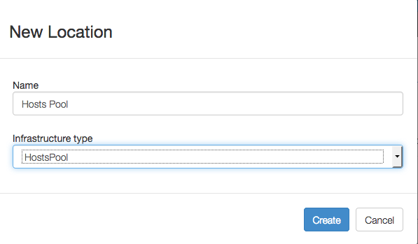

Click on `Create`. A page appears allowing to configure this location, select the
menu `On demand resources` like below :

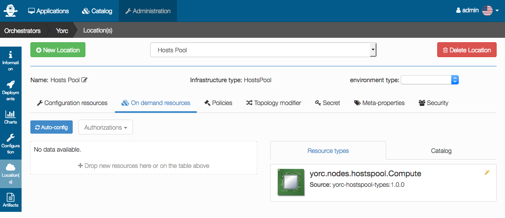

To add an on-demand Compute Node, drag the `yorc.nodes.hostspool.Compute` component
on the right hand side cell,
and drop this component to the left hand side cell, to get this :

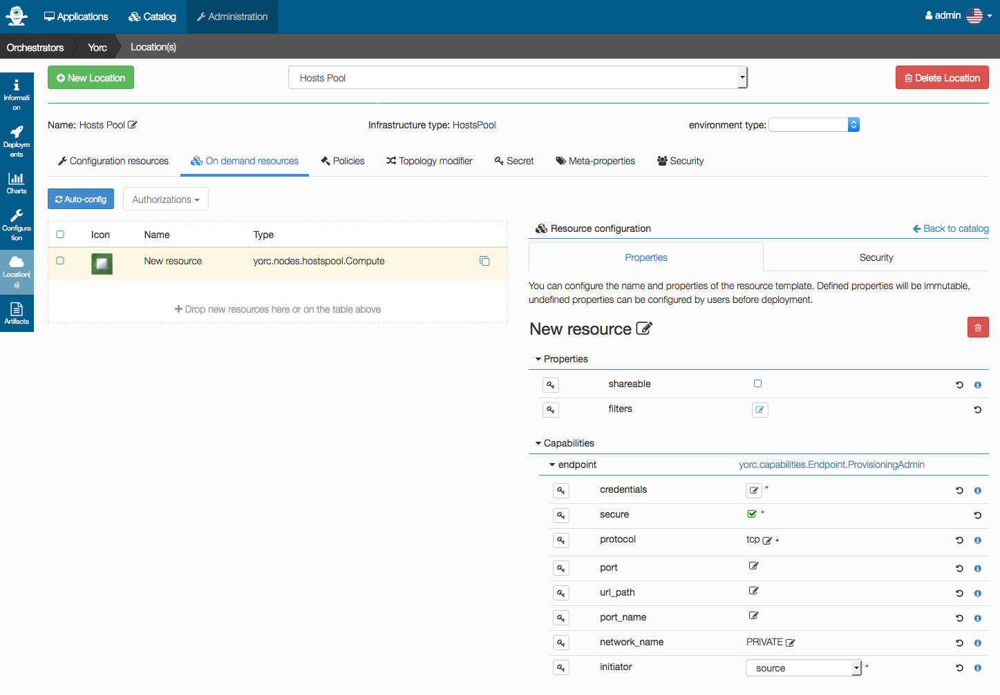

You can select the property shareable if you want to make this compute node shareable,
so that different deployments could use this same resource.

Credentials don’t have to be defined here. For hosts in a Hosts Pool, credentials
are defined in the Yorc server configuration as described in the [installation section](../install/install_yorc_docker.md).

Next step is to [upload Components/Application templates](../applications/upload_from_forge.md)
from the Ystia Forge.

