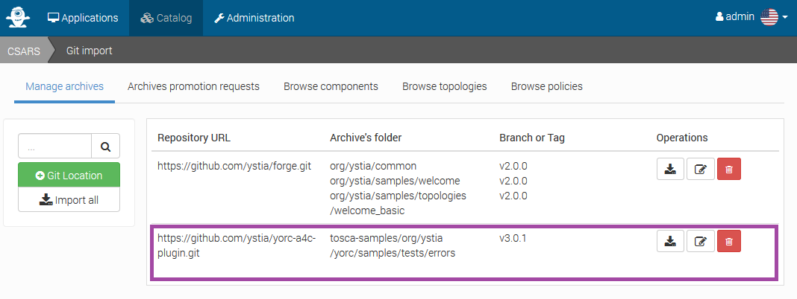
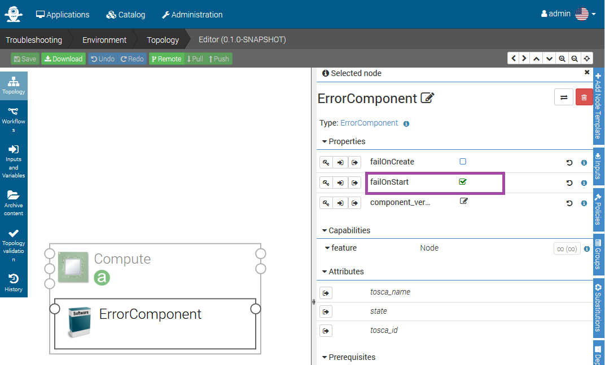
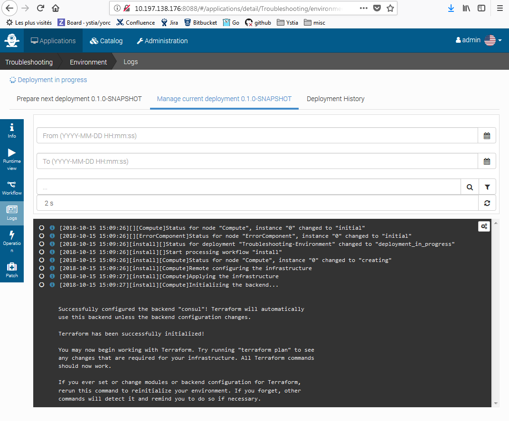

# Troubleshooting an application deployment failure

To create an application failing on demand, you can upload in Alien4Cloud
a test component, importing in Alien4Cloud from menus `Catalog` > `Manage Archives` > `Git import` this repository :
  * `Repository URL`: https://github.com/ystia/yorc-a4c-plugin.git
  * `Tag`: v3.0.2
  * `Archive`: tosca-samples/org/ystia/yorc/samples/tests/errors
  
like this :



Then from `Applications` > `New Applications`, create an application from scratch,
adding in the Topology an abstract compute node, and within this compute node an
 `ErrorComponent` where you will check the property `failOnStart` to let the
 component fail at startup :



Then, deploy the application.

If you have the premimum version of Alien4Cloud, you can access Yorc deployment logs from the UI :



Else you can use yorc CLI to get deployments logs.

First to see the list of deployments, login on the yorc host and run :

```bash
$ yorc deployments list
Deployments:
+-----------------------------+-------------------+
| Id                          | Status            |
+-----------------------------+-------------------+
| Troubleshooting-Environment | DEPLOYMENT_FAILED |
+-----------------------------+-------------------+
```

To get more details and now which step failed :
```bash
$ yorc deployments info Troubleshooting-Environment
Deployment:  Troubleshooting-Environment
Global status: DEPLOYMENT_FAILED

Nodes:
+----------------+----------------+
| Node           | Statuses       |
+----------------+----------------+
| Compute        | started (1/1)  |
| ErrorComponent | error (1/1)    |
+----------------+----------------+

Tasks:
+--------------------------------------+--------+--------+
| Id                                   | Type   | Status |
+--------------------------------------+--------+--------+
| 12aa92b6-70b7-4b3c-8971-90ae10d59b54 | Deploy | FAILED |
+--------------------------------------+--------+--------+

Outputs:
+-------------+-------+
| Output Name | Value |
+-------------+-------+

+-------------+-------+
```

To see the list of events for this deployment since the beginning of the deployment, run :
```bash
$ yorc deployments events -b Troubleshooting-Environment
2018-10-15T15:09:26.270493199Z:	 Deployment: Troubleshooting-Environment	 Node: Compute	 Instance: 0	 State: initial
2018-10-15T15:09:26.337210591Z:	 Deployment: Troubleshooting-Environment	 Node: ErrorComponent	 Instance: 0	 State: initial
2018-10-15T15:09:26.522546733Z:	 Deployment: Troubleshooting-Environment	 Deployment Status: deployment_in_progress
2018-10-15T15:09:26.709463036Z:	 Deployment: Troubleshooting-Environment	 Node: Compute	 Instance: 0	 State: creating
2018-10-15T15:10:00.931211683Z:	 Deployment: Troubleshooting-Environment	 Node: Compute	 Instance: 0	 State: started
2018-10-15T15:10:01.286150014Z:	 Deployment: Troubleshooting-Environment	 Node: ErrorComponent	 Instance: 0	 State: initial
2018-10-15T15:10:01.332106146Z:	 Deployment: Troubleshooting-Environment	 Node: ErrorComponent	 Instance: 0	 State: creating
2018-10-15T15:10:13.585618039Z:	 Deployment: Troubleshooting-Environment	 Node: ErrorComponent	 Instance: 0	 State: created
2018-10-15T15:10:13.63739248Z:	 Deployment: Troubleshooting-Environment	 Node: ErrorComponent	 Instance: 0	 State: configuring
2018-10-15T15:10:13.683492542Z:	 Deployment: Troubleshooting-Environment	 Node: ErrorComponent	 Instance: 0	 State: configured
2018-10-15T15:10:13.706192259Z:	 Deployment: Troubleshooting-Environment	 Node: ErrorComponent	 Instance: 0	 State: starting
2018-10-15T15:10:18.27256253Z:	 Deployment: Troubleshooting-Environment	 Node: ErrorComponent	 Instance: 0	 State: error
2018-10-15T15:10:18.363568653Z:	 Deployment: Troubleshooting-Environment	 Deployment Status: deployment_failed
```

To see all logs for this deployment since the beginning of the deployment, run :

```bash
$ yorc deployments logs -b Troubleshooting-Environment
...
Play [Start Component]

Task [Gathering Facts]
ok: [35.195.84.1] => {}

Task [Log message]
ok: [35.195.84.1] => {
	msg: "Success is not final, failure is not fatal: it is the courage to continue that counts. Winston Churchill"
}}

Task [Fail]
failed: [35.195.84.1] => {
	msg: "I have not failed. I've just found 10,000 ways that won't work. Thomas A. Edison"
}}
Stats:
Host: 35.195.84.1 changed: 0 failures: 1 ok: 3 skipped: 0 unreachable: 0
[2018-10-15T15:10:18.185927162Z][ERROR][Troubleshooting-Environment][install][12aa92b6-70b7-4b3c-8971-90ae10d59b54][ErrorComponent][0][standard][start][]Ansible execution for operation "standard.start" on node "ErrorComponent" failed
[2018-10-15T15:10:18.209202176Z][DEBUG][Troubleshooting-Environment][install][12aa92b6-70b7-4b3c-8971-90ae10d59b54][ErrorComponent][0][standard][start][]operation failed
[2018-10-15T15:10:18.276319355Z][INFO][Troubleshooting-Environment][install][12aa92b6-70b7-4b3c-8971-90ae10d59b54][ErrorComponent][0][][][]Status for node "ErrorComponent", instance "0" changed to "error"
[2018-10-15T15:10:18.27999707Z][DEBUG][Troubleshooting-Environment][install][12aa92b6-70b7-4b3c-8971-90ae10d59b54][ErrorComponent][][][][]Step "ErrorComponent_start": error details: exit status 2
[2018-10-15T15:10:18.316509031Z][ERROR][Troubleshooting-Environment][install][12aa92b6-70b7-4b3c-8971-90ae10d59b54][][][][][]Error 'exit status 2' happened in workflow "install".
[2018-10-15T15:10:18.36769627Z][INFO][Troubleshooting-Environment][install][12aa92b6-70b7-4b3c-8971-90ae10d59b54][][][][][]Status for deployment "Troubleshooting-Environment" changed to "deployment_failed"
```

Here we see this is the task `standard.start` of an ansible playbook that fail.

To get ansible debug logs, keep temporary artifacts on the provisioned Compute
Node at the end of deployment, and keep Ansible recipes generated by Yorc on Yorc server, set the properties `debug`, `keep_operation_remote_path` and `keep_generated_recipes` to `true` in your Yorc configuration in the ansible section, as it was done in the
configuration example provided in section [Install Yorc the easy way (docker)](../install/install_yorc_docker.md) :
```yaml
ansible:
  debug: true
  keep_operation_remote_path: true
  keep_generated_recipes: true
```

When `keep_generated_recipes` is set to `true`, you can see the corresponding Ansible Recipes generated by Yorc on the Yorc host.
For example in our case above, this is available in directory `/var/yorc/work/deployments/Troubleshooting-Environment/ansible/ErrorComponent/standard.start/` :
```bash
$ ls -1 /var/yorc/work/deployments/Troubleshooting-Environment/ansible/12aa92b6-70b7-4b3c-8971-90ae10d59b54/ErrorComponent/standard.start/
ansible.cfg
group_vars
host_vars
hosts
run.ansible.retry
run.ansible.yml
```

You can then go to this directory and re-run this playbook as the yorc user :
```bash
$ ansible-playbook -i hosts run.ansible.yml -v
```

If you need more details, debug parmaters can also be specified in the configuration.

To get debug logs from the Orchestrator itself, set the environment variable `YORC_LOG`
to `1` or `DEBUG` before launching Yorc.


